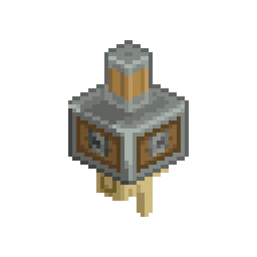
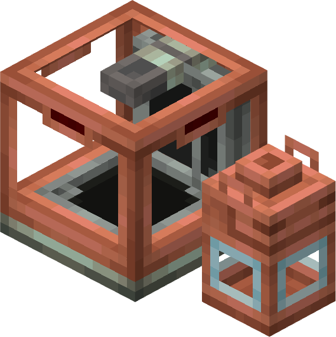
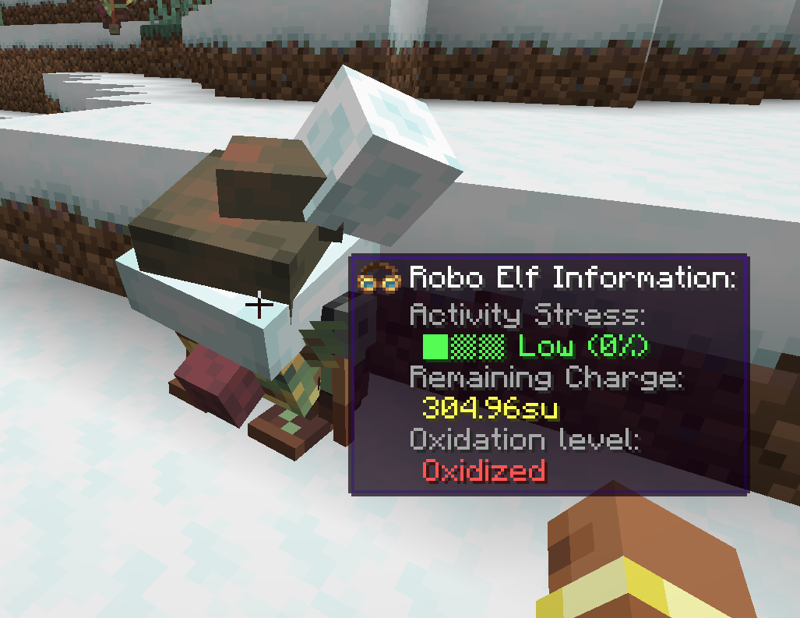
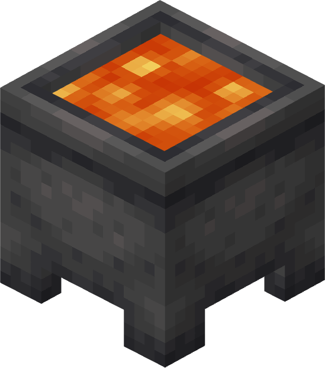

# 
Deployer is a [Create]() library addon built to bring stability over delicate non-modular code in create.

A lot of features, like packages,
factory gauges and others are often coded in create without thinking about possible addons that want to expand that feature,
and here is where we come on.

Deployer aims to bring stability over this topic, by modifying create code in a very precise way:

- We do not overwrite any of the original function, which is the main reason of mod incompatibility
- Every code injection is as precise as possible, and studied to be compatible with eventual code changes
- We leave create's code implementation the same on most things, so that other mods will not find any strange behaviour on their blocks

## Features

### Stock inventory type
Deployer was first developed to expand the logistic system introduced increate 6.0.
A stock inventory type is basically the concept of something that can be put inside a package and
can be ordered from a stock ticker. 

 A basic fluid packaging system, made out of only 4 java classes

### Gauges
Deployer was the right chance to level up [Extra Gauges]() to the next level.
Instead of Extra gauges being the API to carry gauges creation, we inserted that in deployer.
This allows mod makers to easily create gauges without having to include useless builtin gauges

### Entity & Block goggle information
Create currently supports goggle information for block entities only,
but this is expanded by Deployer through the `DeployerGoggleInformation` interface to allow normal blocks
(without a block entity) and entities to display goggle information.

 A goggle information displayed for entities

### Capability fix
Create currently bases all the fluid interaction on block entities.
This means your (or any)
block that provides liquid without being a blockentity will not be handled by create's pipes and more.
This is configurable through the server config

 For example, cauldrons couldn't be handled before

## Please remember that Deployer is still under development and under his first stages
