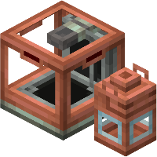
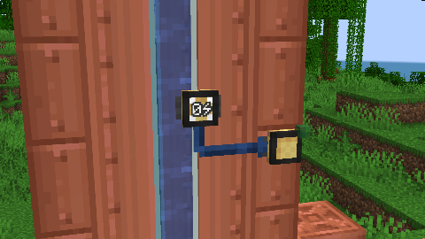
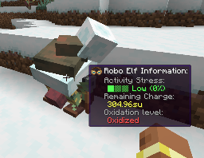
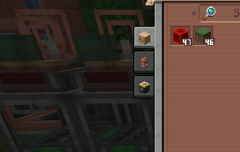
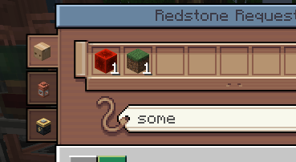

Deployer is a create library for addon-developers to simplify logistics

# Features

## Stock Inventory System

  

  

    Stock Inventory types is a new addition added to follow the 6.0 create update. You can register anything that you want to carry with packages, and deployer will simplify the process. Fluids, Energy, whatever you want!
  

## Gauge Creation API

  

    Deployer provides a comprehensive API for creating custom gauges, evolved from the Extra Gauges addon.
    Deployer handles all the hard part, making it possible for different gauges to stay in the same block!
      
    You can handle connections coming in and coming out from the gauge, and handle everything you want!
  

  

## Extended Goggle Information

  

    Create's vanilla goggle overlay system only supports block entities, limiting what information can be displayed when players look at blocks or entities. Deployer extends this functionality through the <code>DeployerGoggleInformation</code> interface, enabling goggle information display for regular blocks without block entities and for entities in the world.
      
    It's also possible to register your own goggle information through <code>ClientRegisterHelpers</code>, under your specific conditions
  

  

## Custom Stock keeper tabs & Redstone requester tabs

  

    With deployer you can create custom stock keeper and redstone requester tabs. Creating a tab is not necessarily linked to creating a stock inventory type. You can stor any data inside your tab and use it for whatever you want. We already have some ideas in mind for our mods <strong>Create: Extra Gauges</strong>!
  

  

  

  

    On the other side, redstone requesters can also have tabs which are specifically intended to order items!
  

## Optimization and fix
We also include a bunch of fixes and optimizations, and we want to focus the second part of this API on that, improving some useless and expensive algorithms that create for some reason has